# hotel-management-system-c-sharp-.net-with-MVC

<h2>Introduction</h2>

We are now in a world of computer technologies. In this modernized world almost all the businesses are automated to achieve their targets easier and quicker. But still some of the organizations are following traditional methods in storing, retrieving, calculating and analyzing data and information.
Hotel Ramadha is a famous restaurant located in Yakkala, where same scenario is applied. They are currently storing all payrolls, income, expenditure and profitability information...etc. on excel-based system. We Team Together have been asked to develop a computer application which  can be  used to store,  retrieve,  process restaurant data and information using database.

Their requirements include:

<ul>
  <li>Manage employee accounts (Accountant, Cashier, Chef, Delivery Agent...etc.)</li>
  <li>Manage Incomes.</li>
  <li>Manage Expenditures</li>
  <li>Manage Profitability</li>
  <li>Manage Cook Status</li>
  <li>Manage Delivery Status (within the Restaurant)</li>
  <li>Manage Payrolls</li>
  <li>Manage all Reports</li>
</ul>  

<h3>Problems with the existing restaurant management system</h3>

<ul>  
<li>Employees have no proper understanding about EPF and ETF calculations</li>
<li>Employees are not working properly within working hours</li>
<li>No proper method for updating changes</li>
<li>Waste of time searching for records</li>
<li>No proper method for managing reports</li>
<li>High cost on papers</li>
<li>Less security and sometimes papers get misplaced</li>
</ul>  

<h3>Expected benefits from our application</h3>
<ul>  
<li>All details will be saved in the database real time</li>
<li>No need to worry about the security of data</li>
<li>Easy to access and use</li>
<li>Realtime updates on changes</li>
<li>Reduce cost on papers (no need of papers)</li>
<li>Improve the efficiency of workers</li>
<li>Easy report generation for management decisions</li>
</ul>  

<h2>Technical Specification</h3>

What the business actually expected from us

<ul>  
<li>Keep records of all orders</li>
<li>Keep records of all employees</li>
<li>Keep records of all salary details and deductions</li>
<li>Reflect updates of loan payments in the database</li>
<li>Keep track of all incomes and expenditures and calculate profitability</li>
<li>Easy to use and simple user environment</li>
<li>No need to conduct long term training</li>
<li>Manage all reports on a button click</li>
</ul>  

Additional features we decided to add

<ul>  
<li>Prompt messages on errors without crashing the program</li>
<li>Menu items available for sales in image format instead of list view</li>
</ul>  
<h2>Model View Controller (MVC) Architecture</h2>

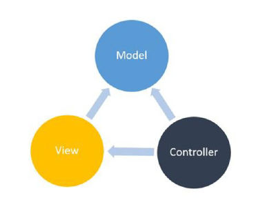

  

We have adapted our restaurant application program to satisfy the MVC pattern and 3 Tier architecture.

<h3>Model</h3>

This is the layer in MVC architecture which is responsible for dealing with logics and database.  In our restaurant application we have grouped the data into different categories according to their behaviors.

<dl>
  <dt>ConnectServer class</dt>
  <dd>This class is responsible for connecting the application with the database. +  SalaryCalculation class</dd>
  <dt>SalaryCalculation class</dt>
  <dd>This is the class which conduct all the salary calculations, loan, advance deductions, EPF,ETF calculations ...etc.</dd> 
  <dt>AdvanceLoan class</dt>
  <dd>This class deals with all loan and advance requests and loan installment payments and its relevant updates.</dd>
  <dt>EmployeeRegisterLogin class</dt>
  <dd>This class is used in registering employees to the application (only Manager)and allowing employees to login to their working environments if required details are correct.</dd>
  <dt>IncomeExpenditure class</dt>
  <dd>This class calculates and insert all incomes, expenditures and profitability when accountant insert relevant data to the system.</dd>
  <dt>Orders class</dt>
  <dd>This is where the all customer orders are processes and status updates of chef and delivery agent are taking place.</dd>
  <dt>ReportGeneration class</dt>
  <dd>In this class all required details for generating reports either Individual or monthly or annually are retrieved from the database accordingly.</dd>
</dl>
 

<h3>Controller</h3>

This layer represents the reflection of the Model in interactive manner via a User Interface. In our application we have several forms to access different layers of hierarchy in the organization

  

<dl>
 <dt>EmployeeRegistration Form</dt>
 <dd>register a new employee with the system </dd>
 <dt>EmployeeLogin Form</dt>
 <dd>allow employee to access the system </dd>
 <dt>AdminArea Form</dt>
 <dd>where employee registration and report generation buttons are located</dd>
 <dt>AccounantArea Form</dt>
 <dd>where Income, Expense, Profitability and Payroll buttons are placed</dd>
 <dt>Cashier Form</dt>
 <dd>this allow the cashier to select user's choice easily</dd>
 <dt>ChefArea Form</dt>
 <dd>displays all orders for the current day in ascending order of orders</dd>
 <dt>DeliveryAgentArea Form</dt>
 <dd>displays cooked orders in ascending order for the day</dd>
 <dt>Income Form</dt>
 <dd>allows accountant to insert incomes</dd> 
 <dt>Expenditure Form</dt>
 <dd>allows accountant to insert expenditures</dd>
 <dt>Profits Form</dt>
 <dd>allows accountant to calculate and insert profitability once a month</dd> 
 <dt>Advances Loans Form</dt>
 <dd>allow accountant to check and grant advance or loan to an employee</dd>
 <dt>PayLoanAdvance Form</dt>
 <dd>allow accountant to check and retrieve payments of an employee for granted loans</dd>
 <dt>Coffee</dt>
 <dd>- black hot drink</dd>
 <dt>PayrollHome Form</dt>
 <dd>buttons for accountant to select between Payrolls</dd>
 <dt>Salary Form</dt>
 <dd>allow accountant to check, calculate and grant salary for an employee</dd>
 <dt>EmployeeDetails Form</dt>
 <dd>Report view of the employee</dd>
 <dt>ProfitabilityDetails Form</dt>
 <dd>Report view of the profitability details </dd>
 <dt>SalaryDetails Form<dt>
 <dd>Report view of the salary</dd>
 </dl>
 

<h3>View</h3>

This layer is the notification layer for the Model about the user behavior. But since we are dealing with and windows application view has nothing to notify the model.

<h2>Target Users of the Application</h2>
 <ul>
  <li>Manager</li>
  <li>Accountant</li>
  <li>Cashier</li>
  <li>Chef</li>
  <li>Delivery Agent</li>
</ul>

<h2>Project Targets and Goals</h2>

This is the project completed for our second-year last semester Integrated Projects module.

 <ul>
<li>Even though this is an coursework we experienced real world situation in business environment.</li>
<li>We have identified how businessman are dealing with day to day problems.</li>
<li>Main goal is to 	deliver a fully functioning and easy usable 	software application for our client (Hotel	Ramadha).</li>
<li>Our next expectation	is to deliver a good product for less	cost.</li>
<li>This application	is not expensive compared to the applications	available in the market.</li>
<li>We have learned	lots of new technologies used today in	the computer world.</li>
<li>Final target of	our group is to make Sri Lankan technology	to its highest,capabilities and	to improve our computer literacy to its	maximum reachable point.</li>

</ul>

<h2>ApplicationInterlaces and 	How it works</h2>

Login Form

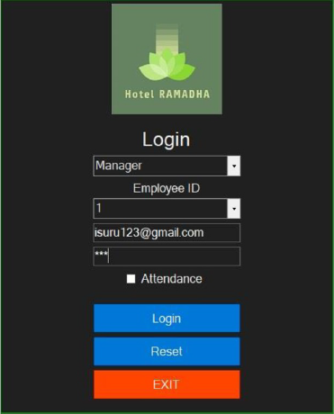

Manager Home Page
  

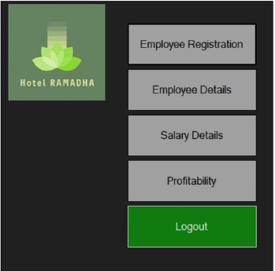

Register Employee Form

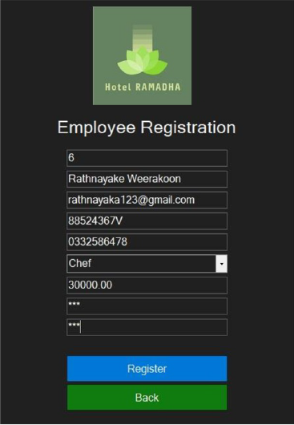

  

Salary Report Form

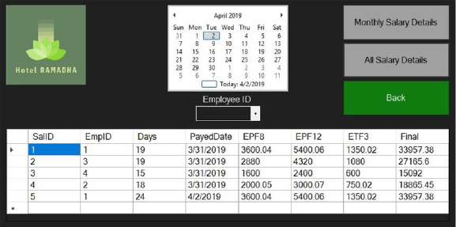

Employee Report Form

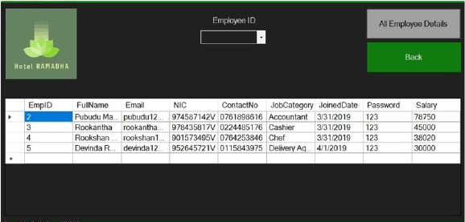

      

Profitability Report Form
      

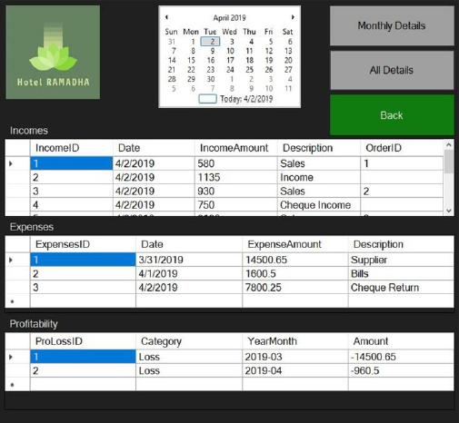

Accountant Home Page

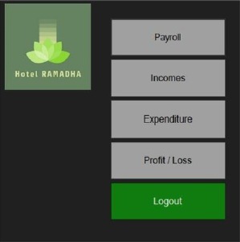

      

Income Form
      

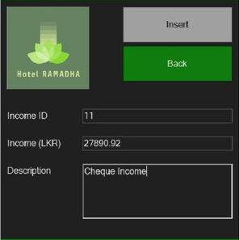

Profit/Loss Form

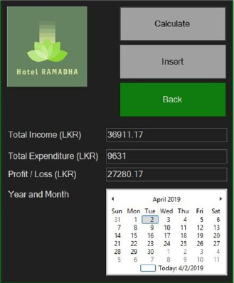

  

Payroll Home Page

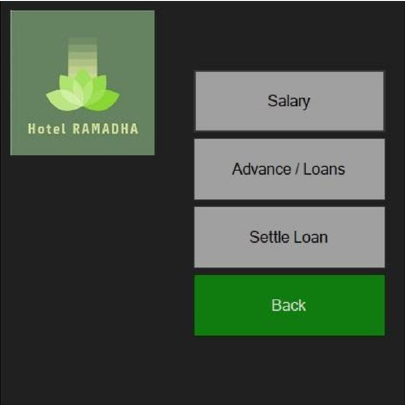
 
   

Salary Calculation Form

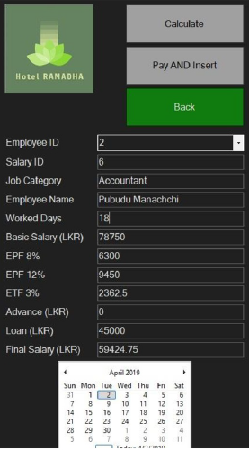
  
    

Advance/Loan Form

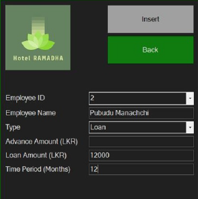
  
     

Cashier Area Form

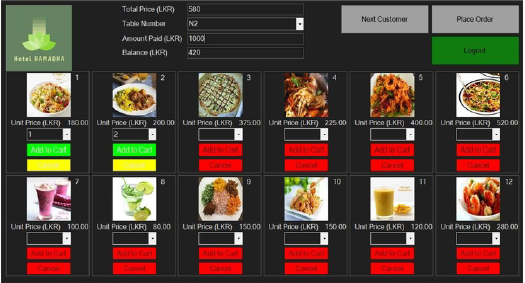
  
  
    

Delivery Agent Form

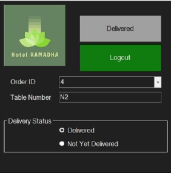
  
  

